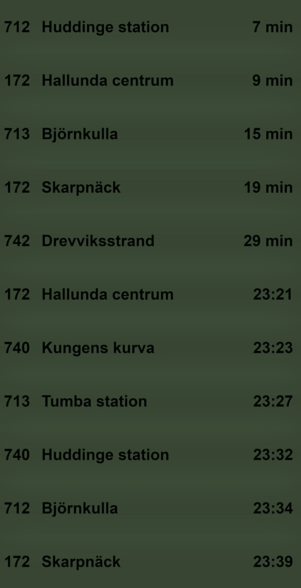

# Dependencies
    Python libraries:
      - requests, flask, flask_cors
  
### How to use
1. Start server: run *SL_fetch.py*
2. Open *index.html* in a browser
3. Toggle fullscreen on

Note: *script.js* will fetch new data every minute.

**Preview:**
